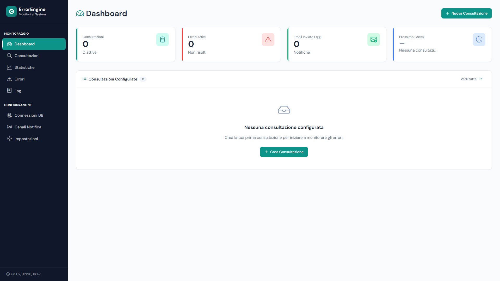
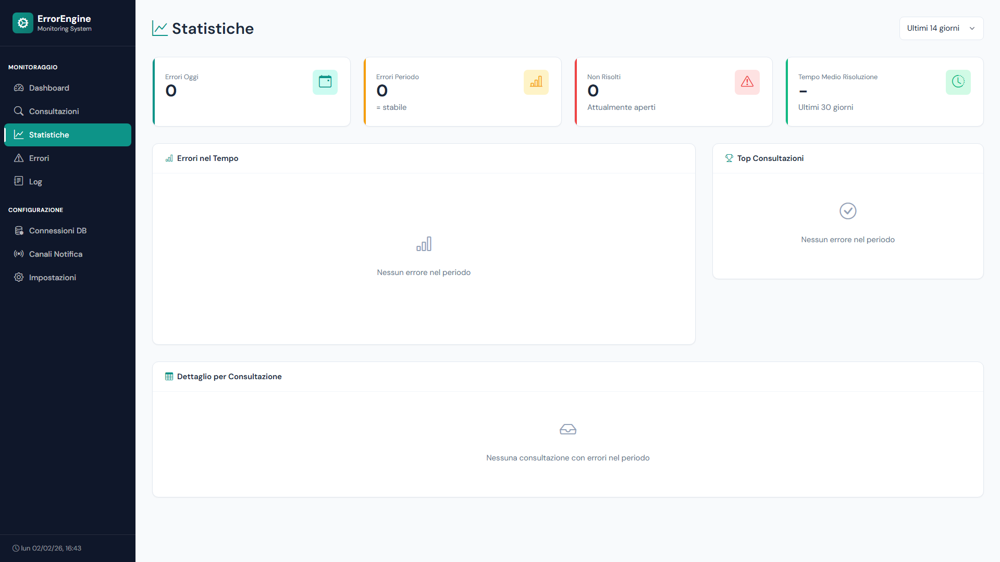
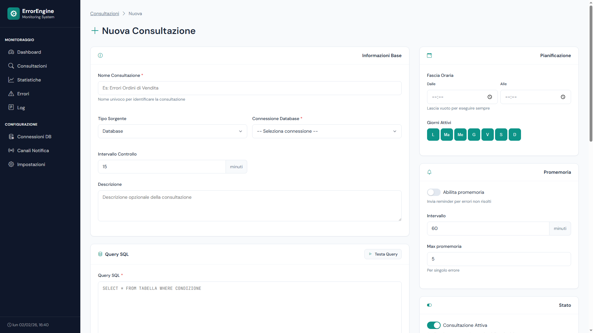

# ErrorEngine

[](https://www.python.org/downloads/)
[](https://flask.palletsprojects.com/)
[](https://opensource.org/licenses/MIT)

A lightweight, self-hosted error monitoring system for databases and APIs.  
Conditional routing, multi-channel notifications, zero agents.



---

## Features

- **Multi-database** — Oracle, PostgreSQL, MySQL, SQL Server, SQLite, IBM i (AS/400)
- **HTTP/REST sources** — Monitor APIs alongside databases
- **Conditional routing** — Route errors to different recipients based on content
- **Multi-channel notifications** — Email, Webhook, Telegram, Microsoft Teams
- **Scheduling** — Intervals, time windows, weekday selection, reminders
- **Self-hosted** — Your data stays on your server

---

## Quick Start

**Requirements:** Python 3.10+

```bash
git clone https://github.com/mpescimoro/ErrorEngine.git
cd ErrorEngine
cp .env.example .env
```

**Windows:** `start.bat`  
**Linux/macOS:** `./start.sh`

Open **http://localhost:5000**

> The script creates a virtual environment and installs dependencies automatically.  
> Edit `requirements.txt` to enable database drivers (commented by default).

---

## Screenshots

| Dashboard | Statistics | Query Detail |
|-----------|------------|--------------|
|  |  |  |

---

## Documentation

|   |   |
|---|---|
| [Getting Started](docs/getting-started.md) | Your first monitor, step by step |
| [Configuration](docs/configuration.md) | Environment variables, database setup |
| [Routing Rules](docs/routing-rules.md) | Conditional routing with 16 operators |
| [API Reference](docs/api-reference.md) | REST endpoints |
| [Templates](docs/templates.md) | Custom email and query templates |
| [IBM i Driver](docs/ibmi-driver.md) | AS/400 via JT400 JDBC |
| [FAQ](docs/faq.md) | Common questions and troubleshooting |

---

## Changelog

**v2.1** — Multi-database, HTTP sources, notification channels, tags, statistics page  
**v2.0** — Conditional routing, reminders, time windows, cleanup automation  
**v1.0** — Initial release

---

MIT License — [mpescimoro](https://github.com/mpescimoro) — `<°))><`
